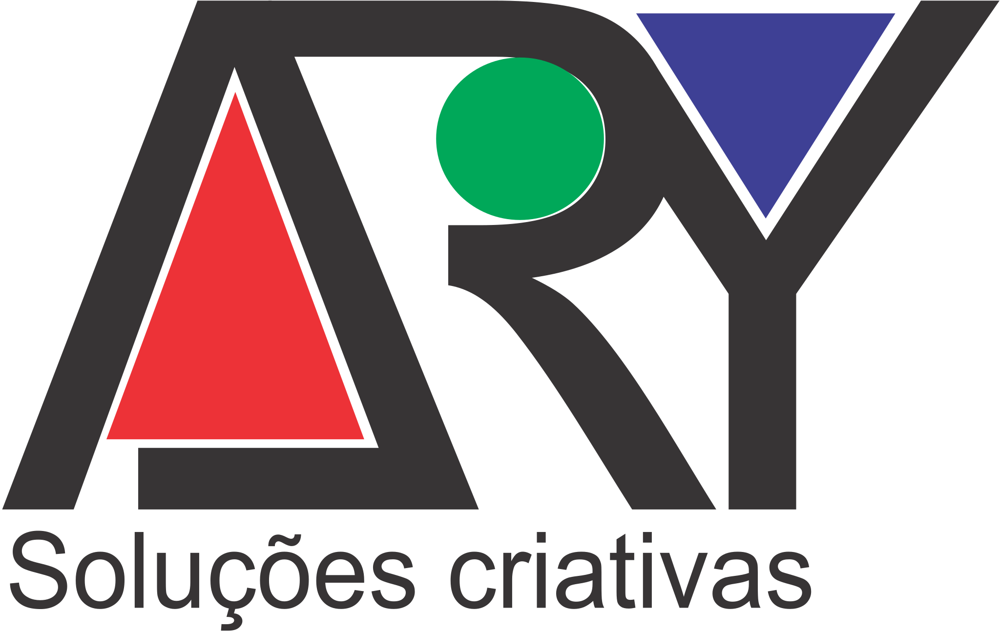

<!DOCTYPE html>
<html lang="pt-BR">
<head>
  <meta charset="UTF-8">
  <meta name="viewport" content="width=device-width, initial-scale=1.0">
  <meta http-equiv="X-UA-Compatible" content="ie=edge">
  <link href="https://fonts.googleapis.com/css?family=Open+Sans" rel="stylesheet">
  <link rel="stylesheet" href="css/style.css">

</head>
<body>
  
  <nav class="navbar">
    

      
      <ul class="navbar__nav">
        <li><a href="#">Sobre</a></li>
        <li><a href="#">Conteúdo</a></li>
        <li><a href="#">Contato</a></li>
      </ul>
    

  </nav>

  <main>
    <section class="posts">

      <h3 class="posts__title">blog posts</h3>

      <aside class="posts__author-area half-column">
        <figure>
          
          <figcaption>
Rafaella Volkmann correspondente do reprograma
</figcaption>
        </figure>
      </aside>

      <article class="posts__main-area half-column">
        <h1>Mulheres incríveis estão se superando no mercado Tech</h1>
        
Ao todo, somos apresentados a 30 mulheres, que tornaram a sua luta peça fundamental na construção do mundo. O projeto conseguiu aqui reunir variadas faixas etárias e diferentes áreas de atuação. 

        
      </article> 

    </section>
  </main>
## Contatos:

   

  <footer>

</body>
</html>

    Feito com amor por Ary Augusto ♥   
   # 
    [Ÿ HŸPE]: https://yhype.me
[GitHub Profile Views Counter]: https://github.com/antonkomarev/github-profile-views-counter

  </footer>
 
 https://visitor-badge.glitch.me/badge?page_id=arycomputer.visitor-badge

 

 

  

  <a href="#overview" style="color: white; margin: 10px;">Overview</a>
  <a href="#features" style="color: white; margin: 10px;">Features</a>
  <a href="#installation" style="color: white; margin: 10px;">Installation</a>
  <a href="#usage" style="color: white; margin: 10px;">Usage</a>
  <a href="#contributing" style="color: white; margin: 10px;">Contributing</a>
  <a href="#license" style="color: white; margin: 10px;">License</a>

## 💜 Olá, meu nome é {seu nome}!

Faça uma breve apresentação sobre você e a sua stack.

🔭 Escreva algum projeto que você desenvolveu ou que atualmente esteja trabalhando nele.

💬 Escreva uma mensagem para que as pessoas entrem em contato com você, ou te faça perguntas.

---

## 🚀 Minhas Skills

<code></code>
<code></code>
<code></code>
<code></code>
<code></code>
<code></code>
<code></code>
<code></code>
<code></code>
<code></code>
<code><code>
<code></code>

---

## ⭐ GitHub Stats

## Visitas

<picture>
  <source media="(prefers-color-scheme: dark)" srcset="github-snake-dark.svg" />
  <source media="(prefers-color-scheme: light)" srcset="github-snake.svg" />
  
</picture>

